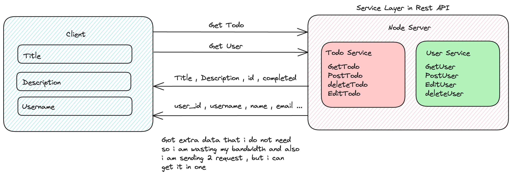
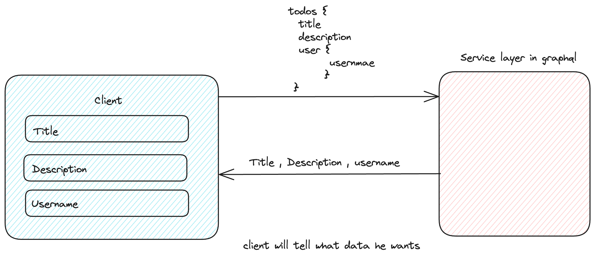

# GraphQL Apollo Fullstack Application

This repository contains a fullstack application with a GraphQL server and a client interface. The server is built with Apollo Server and provides a GraphQL API. The client, created with Apollo Client, communicates with the GraphQL server to perform operations. For demonstration purposes, this application uses DummyJSON to generate and serve fake data.

## Take a Look!

Here's what a typical REST API structure looks like:



And here's how our GraphQL setup does its thing:



### Prerequisites

Before running the project, you need to have [Node.js](https://nodejs.org/) installed on your system.

### Running the GraphQL Server

1. Clone the repository to your local machine.
2. Navigate to the server directory:
   ```bash
   cd server
   ```
3. Install the necessary dependencies:
   ```bash
   npm install
   ```
4. Start the server:
   ```bash
   npm start
   ```
5. Open your browser and go to the following URL to interact with the GraphQL playground:
   ```
   http://localhost:8000/graphql
   ```

### Running the Client

1. Open a new terminal and navigate to the client directory:
   ```bash
   cd client
   ```
2. Install the client dependencies:
   ```bash
   npm install
   ```
3. Launch the development server:
   ```bash
   npm run dev
   ```
4. Visit the following URL in your browser to view the client application:
   ```
   http://localhost:5173
   ```

## Project Structure

- `/server` - Contains all the GraphQL server code with Apollo Server.
- `/client` - Houses the client-side code using Apollo Client to interact with the GraphQL API.
